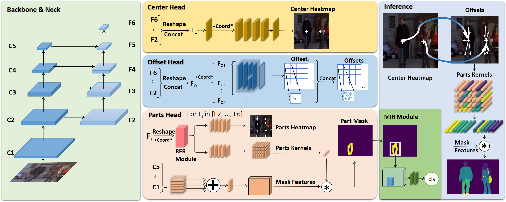
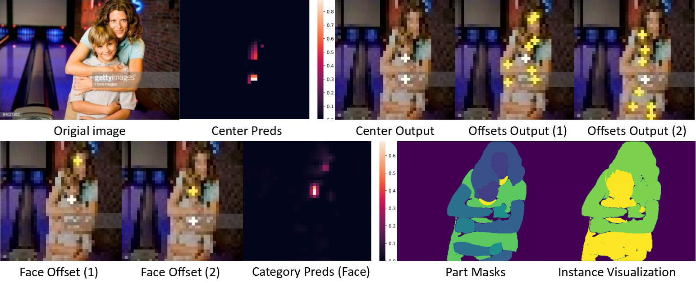

# SMP
The official Implementation of "Single-Stage Multi-Human Parsing via Point Sets and Center-Based Offsets"

[](https://paperswithcode.com/sota/multi-human-parsing-on-mhp-v20?p=single-stage-multi-human-parsing-via-point)

We will release our source codes, pretrained models, and online demos to facilitate further studies.

# SMP: Single-stage Multi-human Parsing
## Understanding Humans with Point Sets and Center-based Offsets

## Introduction

We study the problem of multi-human parsing in this paper. Existing methods are usually based on top-down or bottom-up two-stage paradigms, which usually involve expensive computational costs. In this paper, we instead propose a Single-stage Multi-human Parsing (SMP) framework to improve efficiency and accuracy. Specifically, the proposed method introduces two novel modules to improve the learning ability for instances and tackle the clothing classification problem. It decouples the multi-human parsing problem into two fine-grained sub-problems, i.e., parts and human, and employs the point features in their barycenter positions to obtain their segmentation. Meanwhile, we also generate a series of offsets pointing to the barycenter of parts from the barycenter of the human body, hence the completion the matching of the human body and parts without grouping. 
Additionally, we propose a Refined Feature Retain (RFR) module to extract the global feature of instances through generated mask attention, and a Mask of Interest Reclassify (MIR) module as a trainable plug-in module to refine the classification results with mask attention, which are proved efficient in ablative study.  
Extensive experiments on the MHPv2 dataset demonstrate the effectiveness and efficiency of the proposed method, with mean AP of 47.1%, AP volume score of 48.2%, and PCP score of 51.5%. In particular, the proposed method requires fewer training epochs and less complex model architectures.

## Overview

<div align="center">

</div>

## intermediate results

<div align="center">

</div>

## Visualization


## TODO

- [ ] Organize Code.

## Installation

**Step 0.** Download and install Miniconda from the [official website](https://docs.conda.io/en/latest/miniconda.html).

**Step 1.** Create a conda environment and activate it.

```shell
conda create --name SMP python=3.7 -y
conda activate SMP
```
**Step 2.** Install PyTorch following [official instructions](https://pytorch.org/get-started/locally/), e.g.

On GPU platforms:

```shell
conda install pytorch torchvision -c pytorch
```

On CPU platforms:

```shell
conda install pytorch torchvision cpuonly -c pytorch
```

### Our framework is transfering to MMdetection2.0. So, it requires to install MMCV and MMdetection.

**Step 0.** Install [MMCV](https://github.com/open-mmlab/mmcv) using [MIM](https://github.com/open-mmlab/mim).

```shell
pip install -U openmim
mim install mmcv-full==1.7.0
```

**Step 1.**
```shell
git clone -b mmdet2.0 https://github.com/cjm-sfw/SMP.git
cd SMP
pip install -v -e .
```

## Prepare datasets
### MHP2.0
```
.
├── LV-MHP-v2
│   ├── list
│   ├── test
│   │   └── images
│   ├── train
│   │   ├── images
│   │   ├── parsing_annos
│   │   └── pose_annos
│   └── val
│       ├── images
│       ├── parsing_annos
│       └── pose_annos
```

Download from [MHP2.0](https://github.com/ZhaoJ9014/Multi-Human-Parsing)
Paper Citation:
```
@article{zhao2018understanding,
title={Understanding Humans in Crowded Scenes: Deep Nested Adversarial Learning and A New Benchmark for Multi-Human Parsing},
author={Zhao, Jian and Li, Jianshu and Cheng, Yu and Zhou, Li and Sim, Terence and Yan, Shuicheng and Feng, Jiashi},
journal={arXiv preprint arXiv:1804.03287},
year={2018}
}


@article{li2017towards,
title={Multi-Human Parsing in the Wild},
author={Li, Jianshu and Zhao, Jian and Wei, Yunchao and Lang, Congyan and Li, Yidong and Sim, Terence and Yan, Shuicheng and Feng, Jiashi},
journal={arXiv preprint arXiv:1705.07206},
year={2017}
}
```

### Densepose CoCo
Download from [DensePose](https://github.com/facebookresearch/DensePose)

```
.
├── annotations
│   └── DensePose_COCO
|       └──densepose_coco_2014_minival.json
|       └──densepose_coco_2014_test.json
|       └──densepose_coco_2014_train.json
|       └──densepose_coco_2014_valminusminival.json
├── test2014
├── train2014
└── val2014
```

Paper Citation:
```
  @InProceedings{Guler2018DensePose,
  title={DensePose: Dense Human Pose Estimation In The Wild},
  author={R\{i}za Alp G\"uler, Natalia Neverova, Iasonas Kokkinos},
  journal={The IEEE Conference on Computer Vision and Pattern Recognition (CVPR)},
  year={2018}
  }
```

### CHIP
Download from CIHP official pages.
```
.
├── CHIP_train.json
├── CHIP_val.json
├── CIHP_test.json
├── LV-MHP-v2_colormap.mat
├── train_img
├── train_parsing
├── train_seg
├── val_img
├── val_parsing 
└── val_seg
```

### Note
Modify the value of **datatype**, **data_root** and **data** in config files.

## Scrips
**single gpus script.**
```python
python train.py configs/smp/MHP_r101_fpn_8gpu_1x_offset_parsing_v1_ori_grid_unified_DCN.py --seed 42
```
or
```shell
sh train.sh
```
**distributed train script.**
```shell
sh tools/dist_train.sh configs/smp/MHP_r101_fpn_8gpu_1x_offset_parsing_v1_ori_grid_unified_DCN.py 8
```

## Demo
Completing above preparation, you could run ```demo/inference_demo_parsing.ipynb``` to try infer single image.